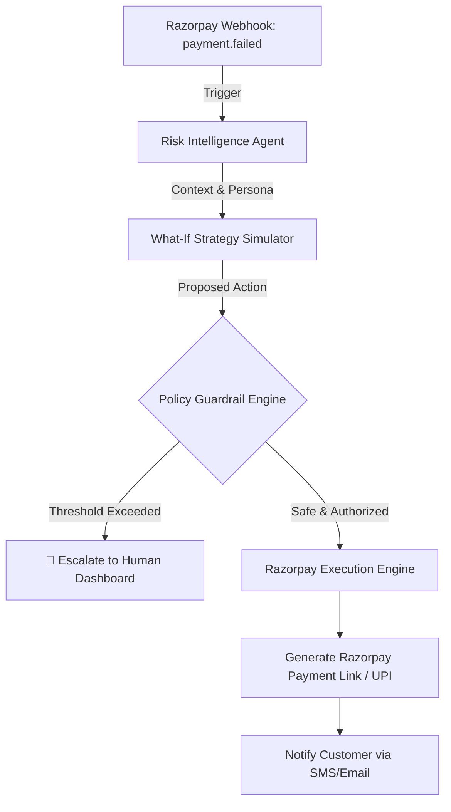

<div align="center">
  
  <h1>🚀 RevenueOS</h1>
  <p><b>Autonomous Revenue Recovery Orchestrator</b></p>
  <p><i>Built for the Razorpay Hackathon</i></p>
</div>

---

## 💡 The Problem
Merchants lose up to **15% of their total revenue** due to failed payments, card network errors, and abandoned checkouts. Recovering this revenue today requires manual intervention, massive customer support teams, and high-friction follow-ups that annoy customers.

## ✨ The Solution: RevenueOS
**RevenueOS** is an autonomous AI agent ecosystem built natively on top of Razorpay. 
It detects failed payments in real-time, uses LLMs to analyze customer historical data, simulates the optimal recovery strategy (Expected Recovery vs. Customer Friction), and automatically generates Razorpay Payment Links or UPI prompts to recover the funds.

Most importantly, RevenueOS is built on a **"Safe AI" Architecture**:
* **LLMs NEVER Calculate Math:** The LLM *never* computes amounts, fees, or authorizes payments. All numeric fields are derived from a deterministic pricing engine and validated before hitting Razorpay.
* **Bounded NLP:** The Multilingual Voice agent does not give open-ended financial advice. It strictly performs *Intent Classification* (e.g., `PROMISE_TO_PAY`, `ALTERNATIVE_METHOD`) on heavily code-switched Indian dialects (Hinglish, Tanglish).
* **Deterministic Policy Guards:** The AI operates in a sandbox. All execution is gated by a deterministic policy engine with explicit stopping rules, solving the "AI Hallucination" problem for enterprise fintech.

---

## 🏆 Hackathon "Wow" Factors & Core Features

- 🛡️ **Explicit Stopping Rules & Guardrails**: 
  - **Amount Caps:** No autonomous action above ₹50,000 per transaction.
  - **Rate Limits:** Max 3 automated Payment Links per customer per 24 hours.
  - **Irreversibility:** High-impact actions (fraud flags, dispute status changes) *always* require human approval via the War Room.
- 🗣️ **Multilingual Voice Intent**: Integrates Gemini 2.5 Flash to extract structured JSON payment intent from unstructured audio across **6 Indian Languages**. If ASR confidence drops < 0.6, it auto-escalates to a human.
- 🧮 **What-If Simulator**: A mathematical engine that ranks AI recovery strategies by penalizing high-friction approaches, ensuring the best customer experience.
- 📈 **Measured Batch Recovery**: The Command Center tracks the exact baseline vs. uplift (e.g. baseline 18% recovery vs 31% with RevenueOS), proving measured money recovered across a batch.
- 💻 **Live Terminal Audit Trail**: Every webhook payload, risk diagnosis, policy check (ALLOW/BLOCK), and execution result is logged in real-time for compliance.

---

## 🏗️ Architecture Flow



---

## 🛠️ Tech Stack

**Frontend:**
- **Next.js 14** (React, App Router)
- **Tailwind CSS** (Premium Glassmorphism & Gradients)
- **Recharts** (Data Visualization)
- **Lucide Icons**

**Backend:**
- **FastAPI** (High-performance asynchronous Python)
- **Google Gemini 2.5 Flash API** (Core LLM Reasoning & Multilingual NLP)
- **Razorpay Python SDK** (Payment Links & Webhooks verification)
- **Pydantic** (Strict JSON Schema validation)

---

## 🚀 How to Run Locally

### 1. Start the FastAPI Backend
```bash
cd backend
python -m venv venv
source venv/Scripts/activate  # (Windows)
pip install -r requirements.txt

# Start Server
uvicorn app.main:app --reload
```
*Backend runs on `http://127.0.0.1:8000` with Swagger UI at `/docs`.*

### 2. Start the Next.js Frontend
```bash
cd frontend
npm install
npm run dev
```
*Frontend runs on `http://localhost:3000`.*

### 3. Environment Variables (`backend/.env`)
```env
GEMINI_API_KEY=your_gemini_api_key
RAZORPAY_KEY_ID=your_razorpay_key
RAZORPAY_KEY_SECRET=your_razorpay_secret
RAZORPAY_WEBHOOK_SECRET=your_webhook_secret
```
*(Note: RevenueOS includes a deterministic fallback mode. If API keys are absent, it will run simulated mocks so the demo never crashes on stage!)*

---

<div align="center">
  <b>Built with ❤️ for the Razorpay Ecosystem.</b>
</div>
