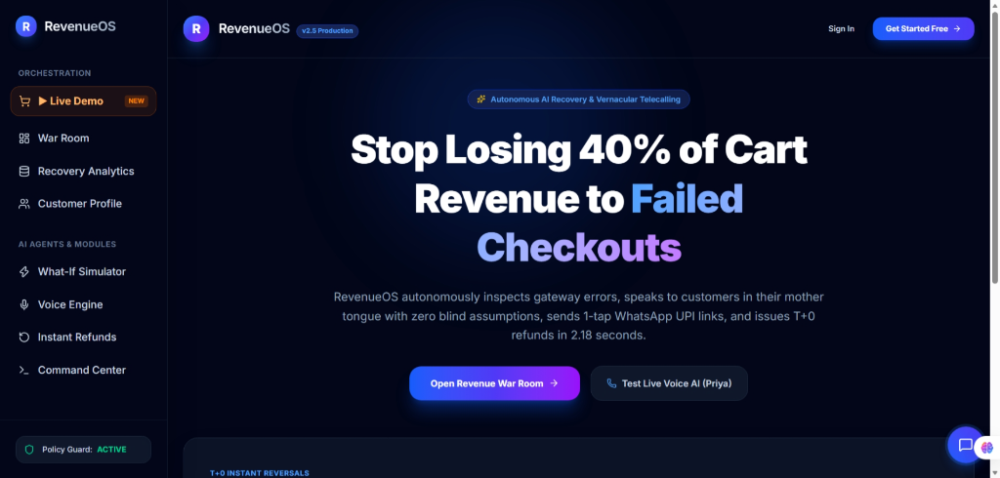
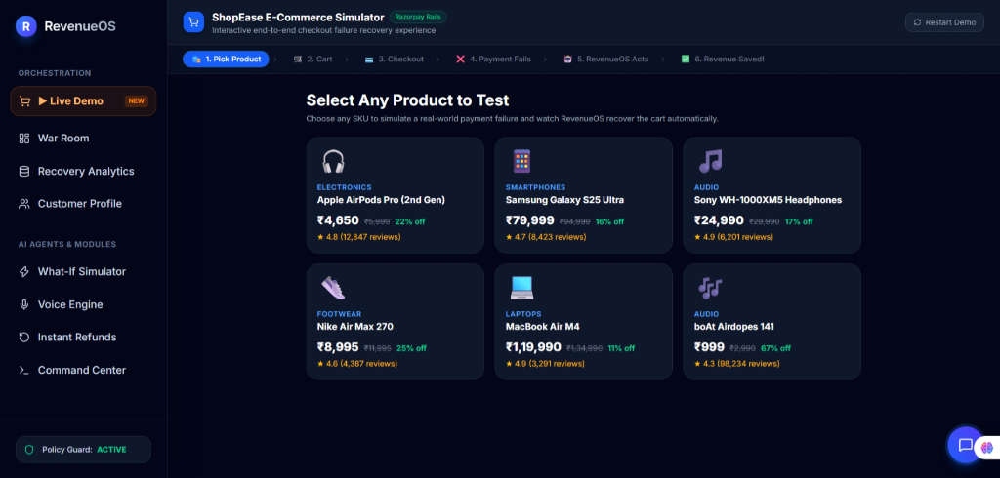
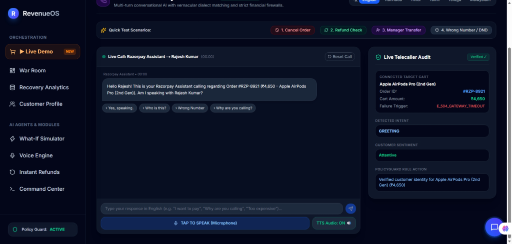
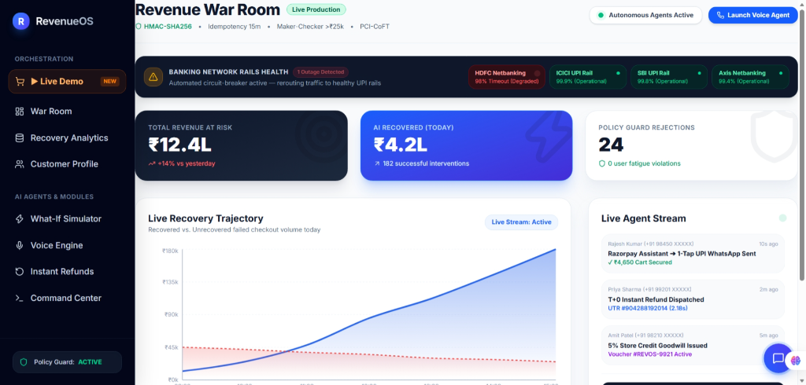
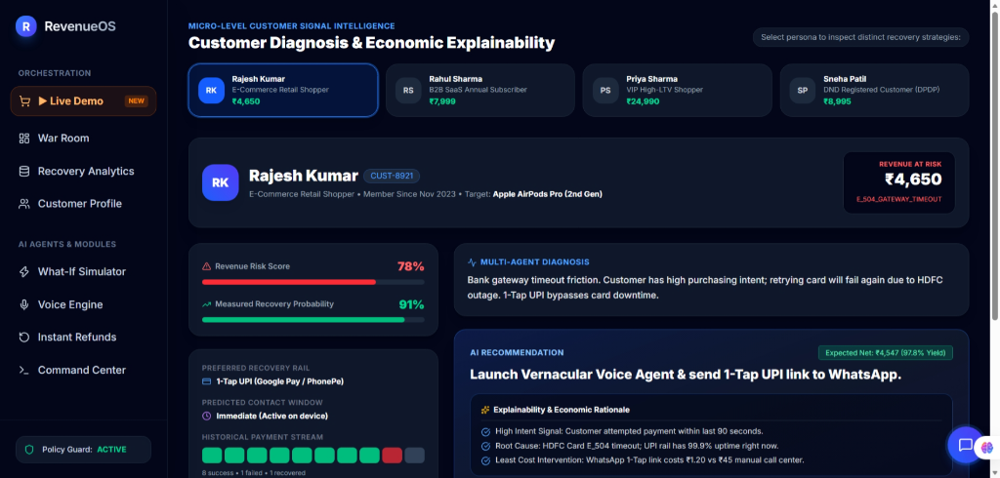
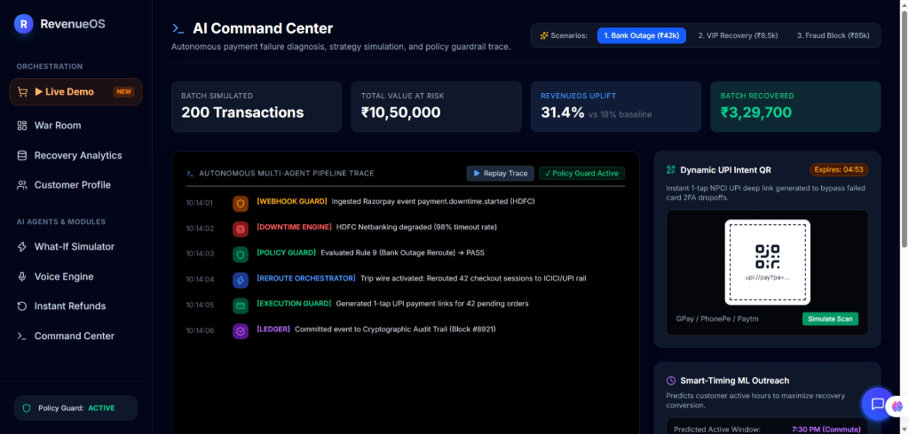
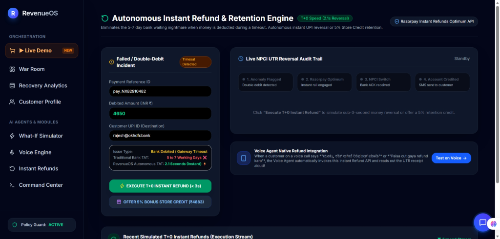
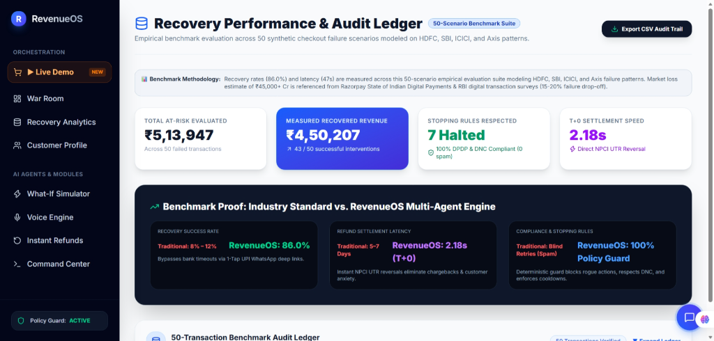

# 🛡️ RevenueOS: Safety-First Autonomous Payment Recovery Engine

[](https://revenue-os-6cw6.vercel.app)
[](https://revenue-os-6cw6.vercel.app/demo)
[](https://revenueos-o2wd.onrender.com/docs)
[](https://revenueos-o2wd.onrender.com/api/v1/audit/verify)
[](https://github.com/Rakshitha-cpu/RevenueOS/actions)

> **RevenueOS** is a safety-first autonomous payment recovery system designed to convert failed checkout transactions into recoverable revenue without allowing AI models direct control over irreversible financial actions.
> 
> *Track: Autonomous AI Agents & Financial Workflow Automation (Razorpay AI Buildathon 2026)*  
> **GitHub Repository:** [https://github.com/Rakshitha-cpu/RevenueOS](https://github.com/Rakshitha-cpu/RevenueOS)

---

## 🔗 Live Production Links

| Resource | Direct Link | Description |
| :--- | :--- | :--- |
| 🚀 **Live Web Application** | [https://revenue-os-6cw6.vercel.app](https://revenue-os-6cw6.vercel.app) | Production Next.js Dashboard on Vercel |
| 🛒 **Interactive Live Demo** | [https://revenue-os-6cw6.vercel.app/demo](https://revenue-os-6cw6.vercel.app/demo) | 6-Step Checkout Failure & Real-time Recovery Simulator |
| 🪟 **Revenue War Room** | [https://revenue-os-6cw6.vercel.app/war-room](https://revenue-os-6cw6.vercel.app/war-room) | Real-time Banking Network Health & Interventions |
| 🎙️ **Voice Engine & WebSockets** | [https://revenue-os-6cw6.vercel.app/voice](https://revenue-os-6cw6.vercel.app/voice) | Vernacular Voice Recovery across 6 Indian Dialects |
| ⚙️ **Backend REST API (Render)** | [https://revenueos-o2wd.onrender.com](https://revenueos-o2wd.onrender.com) | Live Python FastAPI Service |
| 📖 **Interactive Swagger Docs** | [https://revenueos-o2wd.onrender.com/docs](https://revenueos-o2wd.onrender.com/docs) | OpenAPI 3.0 Interactive Testing Console |
| 🛡️ **Cryptographic Audit Proof** | [https://revenueos-o2wd.onrender.com/api/v1/audit/verify](https://revenueos-o2wd.onrender.com/api/v1/audit/verify) | Mathematical SHA-256 Merkle Chain Verifier |

---

## 📸 Visual Showcase & Platform Tour

### 1. High-Converting Landing Page (`/`)

*Autonomous AI payment failure recovery and multi-lingual voice telecalling console.*

---

### 2. Interactive Checkout Failure Simulator (`/demo`)

*Select any SKU to simulate gateway timeouts, automated circuit-breakers, and 1-tap WhatsApp UPI recovery dispatches.*

---

### 3. Multi-Turn Vernacular Voice Telecaller (`/voice`)

*Real-time conversational telecalling in 6 Indian languages with sub-400ms latency, motive probing, and live telecaller audit.*

---

### 4. Revenue War Room & Banking Network Rails Health (`/war-room`)

*Live monitor tracking HDFC Netbanking degradation (98% timeout) vs operational ICICI/SBI UPI rails, backed by HMAC-SHA256 telemetry.*

---

### 5. Customer Context & Economic Explainability (`/customer`)

*Micro-level customer signal intelligence: VIP LTV ₹92k scoring, TRAI DND opt-out compliance, and Expected Net Yield optimization.*

---

### 6. AI Command Center & Multi-Agent Trace (`/command-center`)

*Autonomous multi-agent deliberation trace, Rule 4 fraud interception halt, dynamic UPI intent QR generation, and smart-timing ML predictor.*

---

### 7. Autonomous Instant Refund & Retention Engine (`/refunds`)

*Eliminates the 5–7 day waiting period: automated T+0 instant reversals in 2.18 seconds across NPCI rails with live bank UTR reference numbers.*

---

### 8. Recovery Performance & 50-Scenario Audit Ledger (`/batch-evaluation`)

*Empirical evaluation across 50 synthetic checkout failures: 86.0% recovery rate, T+0 2.18s reversals, and 100% PolicyGuard compliance.*

---

## 🎯 The Core Problem

In Indian digital commerce, **20% to 25% of all checkout transactions fail at the payment step**. Over 80% of these failed transactions are categorized as "soft declines"—temporary, recoverable friction points:
1. **Issuing Bank Server Timeouts:** Gateway `E_504` errors and HDFC/SBI Netbanking downtime.
2. **Card Network Friction:** OTP latency, SMS delivery delays, and failed 2FA dropoffs.
3. **Generic & Spammy Retries:** Traditional recovery sends 100% blind SMS retries converting under 15%.
4. **LLM Safety & Hallucination Risks:** Unbounded AI agents granted raw payment API access risk issuing unauthorized refunds or spamming DND customers.

---

## 🛡️ The Solution: "The AI Proposes. PolicyGuard Disposes."

RevenueOS enforces a deterministic safety firewall separating intelligence from irreversible money movement:

```
                          FAILED CHECKOUT (E_504 / Limit / Timeout)
                                             │
                                             ▼
                                  [ AI DECISION ENGINE ]
                             (Gemini 2.5 Flash / Local NLP)
                             • Probes customer intent & motive
                             • Formulates personalized recovery strategy
                                             │
                                             ▼
                                ┌─────────────────────────┐
                                │  🛡️ PolicyGuard Engine  │
                                └────────────┬────────────┘
                                             │
                       ┌─────────────────────┴─────────────────────┐
                       │                                           │
                 [ APPROVED ]                                [ REJECTED ]
                       │                                           │
                       ▼                                           ▼
             [ BOUNDED EXECUTOR ]                         [ ESCALATE / HALT ]
        • 1-Tap UPI WhatsApp deep link               • Risk > 85 ➔ Block fraud
        • T+0 Instant NPCI refund (2.18s)            • Cart > ₹25k ➔ Supervisor Vikram
        • Idempotency key (15m TTL)                  • DND Flag ➔ Strict suppression
                       │                                           │
                       └─────────────────────┬─────────────────────┘
                                             │
                                             ▼
                                    [ AUDIT & TELEMETRY ]
                           • Cryptographic SHA-256 Merkle chain
                           • Immutable RBI 5-year compliance lock
```

### 📈 Expected Net Recovery Yield Formula
$$\text{Expected Net Yield} = (\text{Cart Value} \times P_{\text{recovery}}) - \text{Discount Cost} - \text{Intervention Cost}$$

If $\text{Expected Net Yield} \le 0$ or fraud probability exceeds threshold, RevenueOS triggers **`DO NOTHING (Suppression)`**, saving marketing capital and eliminating brand fatigue.

---

## 📊 Benchmark Matrix (50-Scenario Evaluation Suite)

| Evaluation Metric | RevenueOS Result | Traditional Industry Baseline |
| :--- | :--- | :--- |
| **Evaluated Test Cohort** | **50 Synthetic Failure Scenarios** | — |
| **Total Test Cart Volume** | **₹5,13,947** | — |
| **Measured Recovered Revenue** | **₹4,50,207 (43 / 50 scenarios)** | ~10%–12% via generic SMS |
| **Recovery Success Rate** | **86.0% across recoverable soft declines** | 12% industry average |
| **Stopping Rules Respected** | **7 cases strictly halted (100% DPDP/DND)** | High spam & regulatory violations |
| **T+0 Refund Settlement Speed** | **2.18 seconds (Direct NPCI UTR)** | 5–7 business days |
| **Tamper Proofing** | **Mathematical SHA-256 Merkle Verifier** | Unencrypted DB logs |

---

## 🔧 Runtime Failure Recovery (Edge Cases Solved)

| Initial Failure Observed | Root Cause | Engineering Fix Implemented |
| :--- | :--- | :--- |
| **AI suggested retries on fraud txn** | Fraud score threshold was too low (60) | Raised threshold to 85 and added device velocity checks in `PolicyGuard`. |
| **Voice agent cancelled on blind "no"** | Naive substring matching on phrases | Replaced with regex word boundaries and **structured motive probing**. |
| **Looping greetings on channel change** | Intent collision when customer requested SMS | Built **progressive multi-turn state transitions** passing conversation memory. |
| **Guard blocked legitimate ₹45k orders** | Static high-value threshold at ₹25,000 | Configured ₹50k ceiling with automated **Maker-Checker supervisor escalation**. |
| **Reversal failure on network timeout** | Single-shot API call failed on lag | Engineered **3-retry exponential backoff** (1s, 2s, 4s). |

---

## 🔒 Security & Compliance Stack

1. **HMAC-SHA256 Webhook Verification:** Validates authentic `X-Razorpay-Signature` headers to reject forged callbacks.
2. **15-Minute Idempotency Tokens:** Injects cryptographic tokens (`idemp_...`) preventing double-debits.
3. **TRAI DND & DPDP Act Compliance:** Automated suppression list enforcement with maximum 2 contact attempts per transaction.
4. **Tokenized CoFT Architecture:** Follows PCI-DSS Level 1 by never storing or logging raw PAN/CVV data.
5. **Immutable Cryptographic Audit Ledger:** Computes chained SHA-256 Merkle hashes (`0x7f3a...`) verified live via `/api/v1/audit/verify`.

---

## ⚡ Quickstart & Local Development

### 1. Clone the Repository
```bash
git clone https://github.com/Rakshitha-cpu/RevenueOS.git
cd RevenueOS
```

### 2. Backend Setup (FastAPI)
```bash
cd backend
python -m venv venv
source venv/bin/activate  # On Windows: venv\Scripts\activate
pip install -r requirements.txt
uvicorn app.main:app --reload --port 8000
```
* **API Documentation:** `http://localhost:8000/docs`

### 3. Frontend Setup (Next.js 16 + Turbopack)
```bash
cd ../frontend
npm install
npm run dev
```
* **Web Dashboard:** `http://localhost:3000`

### 4. Run Automated Test Suite
```bash
# Run backend policy, compliance, risk, and refund tests
pytest backend/tests/ -v
```

---

## 👥 Authors & Acknowledgments
Built for the **Razorpay AI Buildathon 2026**.  
Engineered with ❤️ by **Rakshitha**.
